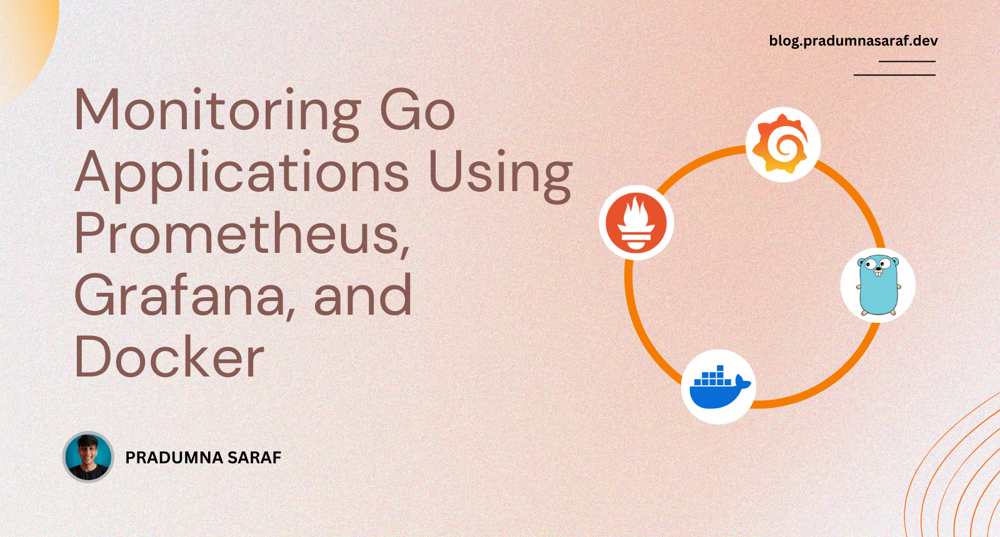

 

Pradumna is a Developer Advocate, Docker Captain, and a DevOps and Go Developer. He is passionate about Open Source and has mentored hundreds of people to break into the ecosystem. He also creates content on X (formerly Twitter) and LinkedIn, educating others about Open Source and DevOps tools. Pradumna enjoys engaging with people in person and delivering talks.

### Latest Blog Post

<a href="https://dev.to/pradumnasaraf/monitoring-go-applications-using-prometheus-grafana-and-docker-33i5" title="Monitoring Golang Applications with Custom Prometheus Metrics and Grafana"><strong>Monitoring Golang Applications with Custom Prometheus Metrics and Grafana</strong></a>

<strong>Published on: 21st April 2025</strong>
 Monitoring is important for any application. It helps us ensure that our application is running smoothly and allows us to detect any issues before they become critical. Because in real case scenarios....
  
