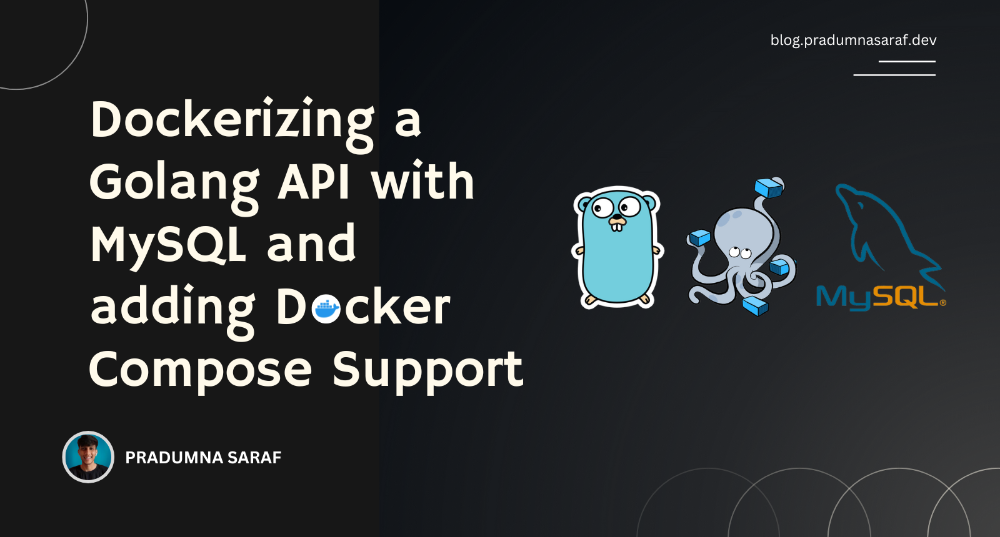

 

Pradumna is a Developer Advocate, Docker Captain, and a DevOps and Go Developer. He is passionate about Open Source and has mentored hundreds of people to break into the ecosystem. He also creates content on X (formerly Twitter) and LinkedIn, educating others about Open Source and DevOps tools. Pradumna enjoys engaging with people in person and delivering talks.
  

### Latest Blog Post

<a href="https://dev.to/pradumnasaraf/dockerizing-a-golang-api-with-mysql-and-adding-docker-compose-support-9b1" title="Dockerizing a Golang API with MySQL and adding Docker Compose Support"><strong>Dockerizing a Golang API with MySQL and adding Docker Compose Support</strong></a>

<strong>Published on: 10 Aug 2024</strong>
  Developing and testing APIs locally connected to a database is no joke. The database often becomes a pain point. However, using Docker, the process becomes easier and much simpler, making replication easy. In this blog, we will see how we can Dockerize a Golang.... 
  

### Achievements

- 🏆 Winner - Daily.dev RSS Feed Hackathon. - [`DDRSS`](https://github.com/Pradumnasaraf/DDRSS)           
- 🏆 Winner - Postman API Fest 2022. - [`Note API`](https://github.com/Pradumnasaraf/Postman-API-Fest-22)      
