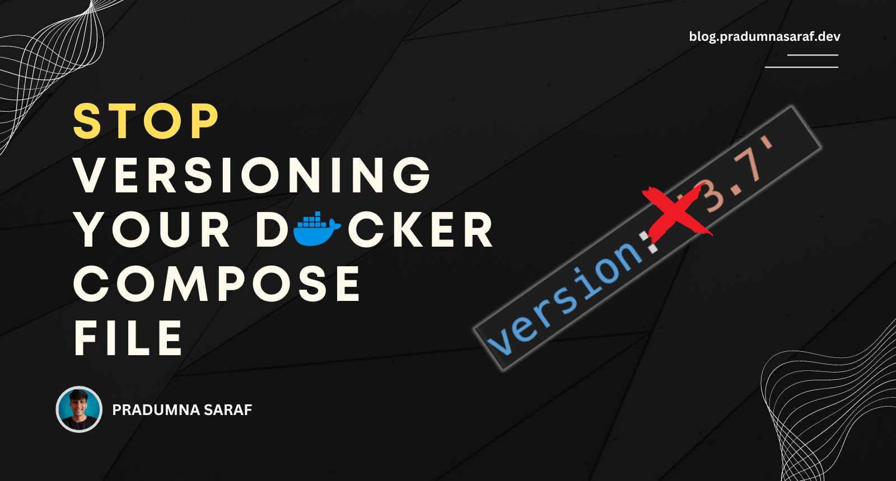

 

Pradumna is a Developer Advocate, Docker Captain, and a DevOps and Go Developer. He is passionate about Open Source and has mentored hundreds of people to break into the ecosystem. He also creates content on X (formerly Twitter) and LinkedIn, educating others about Open Source and DevOps tools. Pradumna enjoys engaging with people in person and delivering talks.
  

### Latest Blog Post

<a href="https://dev.to/pradumnasaraf/stop-versioning-your-docker-compose-file-1f41" title="STOP versioning your Docker Compose file"><strong>STOP versioning your Docker Compose file</strong></a>

<strong>Published on: 10 Aug 2024</strong>
  If you are a long-term Docker Compose fanatic like me, you know we have come a long way. Currently, we are using version 2 of Compose, which is written in Golang. 
Version 1 of Compose was written in Python and has been deprecated. The last update was... 
  

### Achievements

- 🏆 Winner - Daily.dev RSS Feed Hackathon. - [`DDRSS`](https://github.com/Pradumnasaraf/DDRSS)           
- 🏆 Winner - Postman API Fest 2022. - [`Note API`](https://github.com/Pradumnasaraf/Postman-API-Fest-22)      
