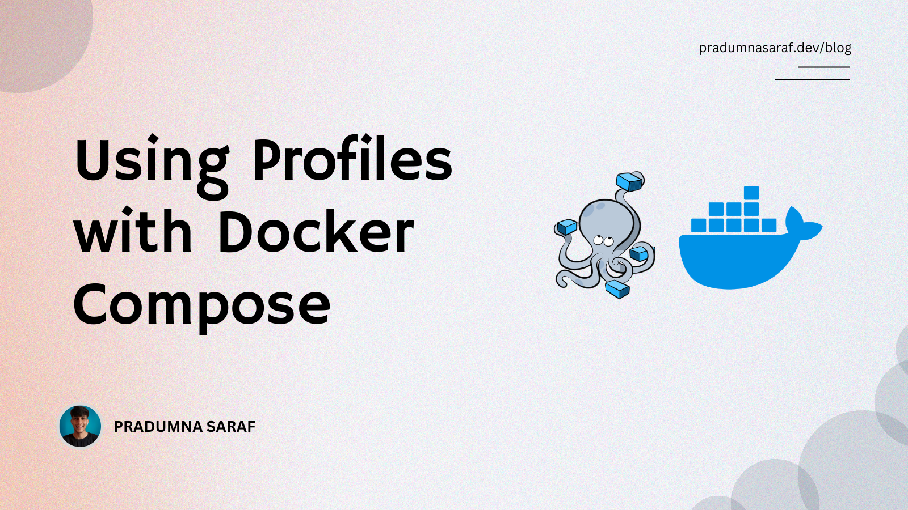

 

Pradumna is an Open Source Developer, Docker Captain, and Microsoft MVP. 

He is passionate about Open Source and has mentored hundreds of people to break into the ecosystem. He also creates content on X (formerly Twitter) and LinkedIn, educating others about Open Source and DevOps tools. Pradumna enjoys engaging with people in person and delivering talks. To learn more about Pradumna, visit [pradumnasaraf.dev](https://pradumnasaraf.dev).

### Latest Blog Post

<a href="https://dev.to/pradumnasaraf/using-profiles-with-docker-compose-238l" title="Using Profiles with Docker Compose"><strong>Using Profiles with Docker Compose</strong></a>

<strong>Published on: 29th January 2026</strong>
 Most applications don’t need all Docker Compose services running all the time with the core application, such as development tools, like monitoring and debugging. For example, in a full-stack application, we want the backend, database, and maybe a frontend running...<a href="https://dev.to/pradumnasaraf/using-profiles-with-docker-compose-238l">read mode</a> 
  
