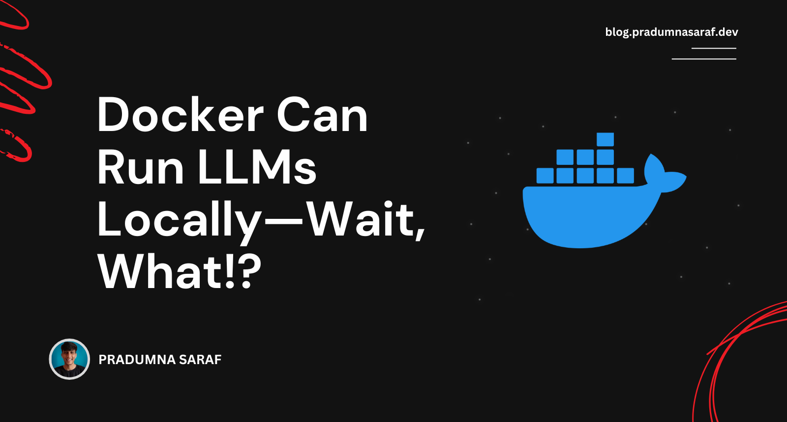

 

Pradumna is a Developer Advocate, Docker Captain, and a DevOps and Go Developer. He is passionate about Open Source and has mentored hundreds of people to break into the ecosystem. He also creates content on X (formerly Twitter) and LinkedIn, educating others about Open Source and DevOps tools. Pradumna enjoys engaging with people in person and delivering talks.

### Latest Blog Post

<a href="https://dev.to/pradumnasaraf/docker-can-run-llms-locally-wait-what-35fn" title="Docker Can Run LLMs Locally—Wait, What!?"><strong>Docker Can Run LLMs Locally—Wait, What!?</strong></a>

<strong>Published on: 7 April 2025</strong>
 Using Docker to run Large Language Models (LLMs) locally? Yes, you heard that right. Docker is now much more than just running a container image. With Docker Model Runner, you can run and interact with LLMs locally....
  
