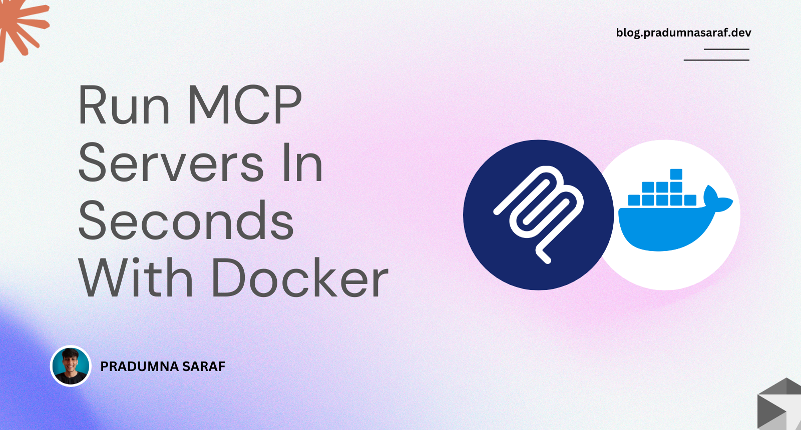

 

Pradumna is a Developer Advocate, Docker Captain, and a DevOps and Go Developer. 

He is passionate about Open Source and has mentored hundreds of people to break into the ecosystem. He also creates content on X (formerly Twitter) and LinkedIn, educating others about Open Source and DevOps tools. Pradumna enjoys engaging with people in person and delivering talks. To learn more about Pradumna, visit [pradumnasaraf.dev](https://pradumnasaraf.com).

### Latest Blog Post

<a href="https://dev.to/pradumnasaraf/run-mcp-servers-in-seconds-with-docker-1ik5" title="Run MCP Servers In Seconds With Docker"><strong>Run MCP Servers In Seconds With Docker</strong></a>

<strong>Published on: 25th June 2025</strong>
 Model Context Protocol (MCP) has taken the AI world by storm. It has become the de facto standard for how an AI Agent connect with tools, services, and data. As this is shaping up rapidly, working with... <a href="https://dev.to/pradumnasaraf/run-mcp-servers-in-seconds-with-docker-1ik5">read mode</a> 
  
