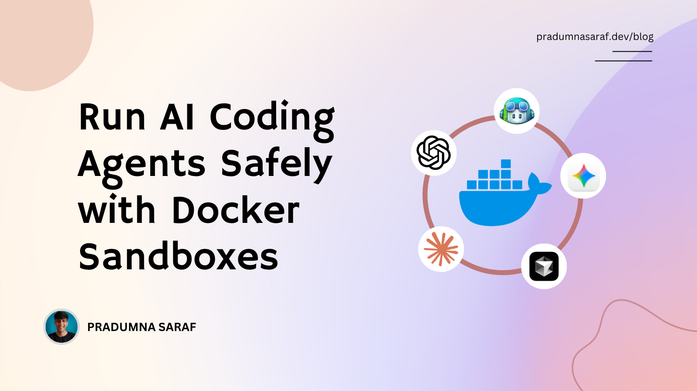

 

Pradumna is an Open Source Developer, Docker Captain, and Microsoft MVP. 

He is passionate about Open Source and has mentored hundreds of people to break into the ecosystem. He also creates content on X (formerly Twitter) and LinkedIn, educating others about Open Source and DevOps tools. Pradumna enjoys engaging with people in person and delivering talks. To learn more about Pradumna, visit [pradumnasaraf.dev](https://pradumnasaraf.dev).

### Latest Blog Post

<a href="https://pradumnasaraf.dev/blog/run-ai-coding-agents-safely-with-docker-sandboxes" title="Run AI Coding Agents Safely with Docker Sandboxes"><strong>Run AI Coding Agents Safely with Docker Sandboxes</strong></a>

<strong>Published on: 4th June 2026</strong>
 AI agents can run commands, modify files, and download files from untrusted sources directly on a developer machine, which creates a major security risk. There needs to be a way to safely run agents and isolate how they interact with the network, files, host system, etc...<a href="https://pradumnasaraf.dev/blog/run-ai-coding-agents-safely-with-docker-sandboxes">read mode</a> 
  
