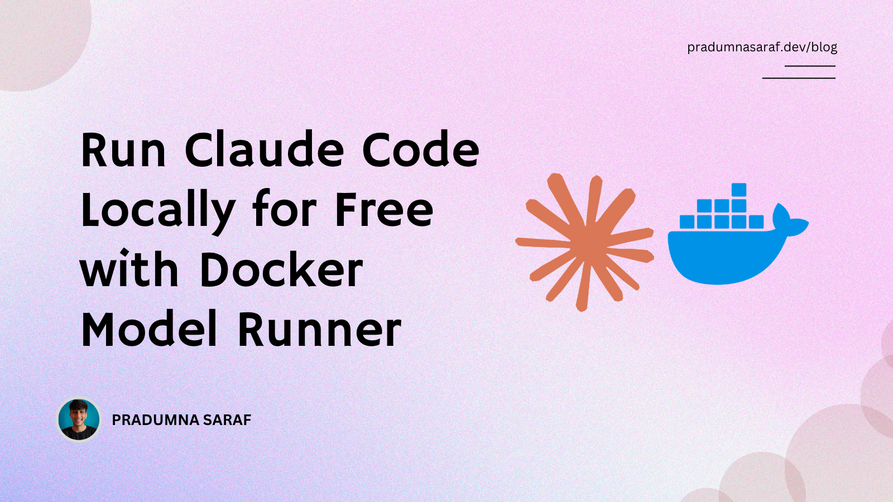

 

Pradumna is an Open Source Developer, Docker Captain, and Microsoft MVP. 

He is passionate about Open Source and has mentored hundreds of people to break into the ecosystem. He also creates content on X (formerly Twitter) and LinkedIn, educating others about Open Source and DevOps tools. Pradumna enjoys engaging with people in person and delivering talks. To learn more about Pradumna, visit [pradumnasaraf.dev](https://pradumnasaraf.dev).

### Latest Blog Post

<a href="https://dev.to/pradumnasaraf/using-claude-code-with-docker-model-runner-36eo" title="Using Claude Code with Docker Model Runner"><strong>Using Claude Code with Docker Model Runner</strong></a>

<strong>Published on: 8th May 2026</strong>
 We know that the Claude Code is phenomenal for development and code. But we can easily run out of tokens, and it becomes quickly expensive as your project becomes more complex. What if we can keep all the good parts about the Claude Code, but use the local models instead...<a href="https://dev.to/pradumnasaraf/using-claude-code-with-docker-model-runner-36eo">read mode</a> 
  
